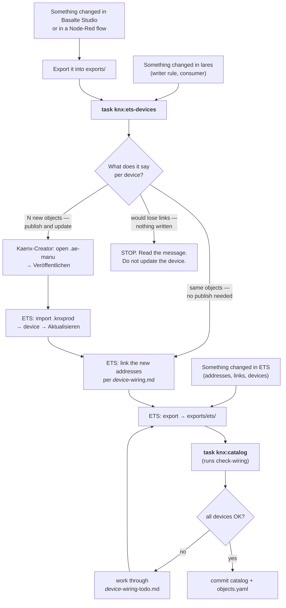

# ETS model of the software bus participants

Three bus participants exist as software, not hardware: the **KNX-NATS
bridge**, the **Basalte Core S4** visualisation and **Node-Red**. Each is
modelled in ETS as a real device whose product database is *generated*
from this repo — ETS is the checkable view, lares is the source. The
historical GIRA placeholders ("dummies") are being retired; see the
migration section. Decisions and their rejected alternatives:
[ADR-0001](../adr/0001-collector-objects-from-config-for-software-bus-devices.md),
[ADR-0002](../adr/0002-coupler-forwarding-carries-bus-visibility.md).
Migration tracker: issue #1557.

## Which command, when

Start from what happened. Every path ends in the same verification.



| Task | Run it when | Reads | Writes |
| --- | --- | --- | --- |
| `task knx:ets-devices` | a footprint changed (lares config, Studio export, flows) — or you are unsure whether it did | the three footprints, the ETS export, the template, `scripts/kaenx/objects.yaml` | `~/Downloads/<device>.ae-manu` + `-wiring.md`; updates `objects.yaml` |
| `task knx:catalog` | after **every** ETS export | the ETS export | `ga-catalog.yaml`, then runs `check-wiring` |
| `task knx:check-wiring` | on demand, to see what is still open | the ETS export, the three footprints, `objects.yaml` | `~/Downloads/<device>-wiring-todo.md` per device with findings |

All three need `KNXPROJ_PASSWORD=…` in the environment; without it they
stop with one sentence saying so.

## The chain at a glance

```
1  SOURCES — each system states its own footprint, where it is configured
     bridge:   writer-rules.yaml + *_from_knx consumers  (kubernetes/, deployed)
     Basalte:  exports/basalte/Steinroth.bcfg            (Studio export)
     Node-Red: exports/node-red/flows.json               (flow export)

2  ONE COMMAND:  task knx:ets-devices
     reads the three sources
     + exports/ets/Steinroth.knxproj    (names, DPTs, and what is installed)
     + scripts/kaenx/template.ae-manu   (Kaenx version specifics)
     + scripts/kaenx/objects.yaml       (object numbers — see below)
     writes per device to ~/Downloads:
       <device>.ae-manu       Kaenx-Creator project, collector objects
       <device>-wiring.md     checklist: which addresses on which object
     and tells you per device: "only links" or "publish and update"

3  ON THE ETS VM (only when step 2 said "publish and update")
     Kaenx-Creator: open the .ae-manu → publish → .knxprod
     ETS: import the product → device → Aktualisieren (links stay)
     then, always: link the new addresses per worksheet

4  BACK (verification)
     fresh ETS export into exports/ets/ → task knx:catalog
     check-wiring runs with it and leaves a todo worksheet per open device
     all green ⇒ commit ga-catalog.yaml and objects.yaml
```

## Why links survive an update — the object registry

ETS keeps a group link on an object *number*. An application update
keeps the links of every object whose number and identity are unchanged
and drops the rest — silently. So the object numbers must never move.

`scripts/kaenx/objects.yaml` is where they live. The generator
maintains it and you commit it:

- an object keeps its number forever; a new collector takes the next
  free number, appended, never inserted;
- a device's section is seeded from the device in the ETS export, so
  the file can never contradict what is installed;
- a key the configuration no longer produces stays in the file and is
  still emitted as a legacy object, so links on it survive — delete it
  only once its links are gone;
- the section also records the application version last handed to
  Kaenx-Creator, so every publish lands above it (ETS silently ignores
  a re-import of a version it already knows).

On top of that the generator refuses to write when an installed object
that carries links would be dropped or renumbered — the situation that
lost 973 links on 2026-09-12. That message means: stop, look at the
registry, and only pass `--accept-loss` if the loss is intended.

## Target picture

| Device | Address source (the footprint) | Objects | Flags |
| --- | --- | --- | --- |
| KNX-NATS-Bridge | `writer-rules.yaml` targets (Transmit+Read) ∪ consumed addresses from the `*_from_knx` consumer manifests (Write) | ~55 | per direction |
| Basalte Core S4 | Studio-export bindings (`scripts/basalte_gas.py` on `exports/basalte/*.bcfg`) | ~95 | Write+Transmit |
| Node-Red | flow-export addresses (`scripts/node_red_gas.py` on `exports/node-red/flows.json`) | a handful | Write+Transmit |

Objects are **collectors**: one per main group × datapoint type — the
exact subtype (5.001, 9.001, …), with a main-type fallback for
addresses ETS types loosely — per direction on the bridge, named after
the ETS group-range names and grouped per main group in the object
tree. Every address of a kind is linked to its collector — which is why
wiring is a multi-select per object, not per address.

`writable` in the GA catalog stays exact: the only software Write flags
are on the bridge's consumed-address collectors, so "a NATS consumer acts
on this address" is visible in ETS. Basalte and Node-Red are excluded
from the write vote (`--ignore-write-from` in `task knx:catalog`),
because a visualisation receiving an address to display it is
indistinguishable from acting on it.

## Bus visibility (why the couplers forward)

The bridge mirrors the whole bus to NATS, far beyond its own footprint.
That visibility is provided by the couplers, not by objects: `1.2.0`
forwards group telegrams upstream, `1.1.0` forwards downstream; the
opposite directions stay filtered. Do not "optimise" this back to
filtering — every address missing from the filter tables disappears from
TSDB silently. Details: ADR-0002.

## Regenerating the devices

```
KNXPROJ_PASSWORD=… task knx:ets-devices [output-dir]   # default ~/Downloads
```

Inputs: the in-repo ETS export (names, DPTs, group-range names, and the
installed applications), the writer rules, the consumer manifests, the
Basalte Studio export, the Node-Red flow export and the object
registry. Foreign-system exports live in `exports/` (see its README);
lares' own deployed truths stay under `kubernetes/`. Template:
`scripts/kaenx/template.ae-manu` — an empty project saved once by the
ETS VM's Kaenx-Creator installation; it supplies everything
version-specific (mask, load procedures, language).

Output per device: `<slug>.ae-manu` (the Kaenx-Creator project) and
`<slug>-wiring.md` (the wiring worksheet: per collector, exactly the
addresses to link; new objects are marked). Addresses without a DPT,
with a DPT unknown to Kaenx-Creator, or listed in a footprint but absent
from ETS are reported; the last case fails the run — configuration
pointing at nothing is the wiring error this model exists to expose.

On the ETS VM, when the run said "publish and update": open the
`.ae-manu` in Kaenx-Creator → Veröffentlichen → import the `.knxprod`
into ETS → select the device → Eigenschaften → Information →
Applikationsprogramm → **Aktualisieren**. Never delete and re-add the
device; that is what loses the links. Then link the new addresses per
worksheet (sort the GA list, multi-select a block, drag onto the
collector).

## Growth and maintenance

- **New address of an existing kind** — same main group, datapoint
  type and direction as an existing collector: the generator says "only
  links"; link it in ETS, no Kaenx round trip. `task knx:check-wiring`
  nags until the link exists.
- **New kind, or a footprint change** (first address of a subtype in a
  main group, new consumer, new Basalte datapoint or flow kind):
  re-export the changed system into `exports/` first, then regenerate;
  the generator says "N new objects — publish and update". The new
  objects are appended, every existing one keeps its number, the update
  keeps the links.
- **Identity, do not touch**: per-device GUID (deterministic), serial and
  order number (name slug), application number (100/101/102 by task
  order), and the object numbers in `objects.yaml`.
- **Versions take care of themselves**: the generator takes the highest
  of the installed version and the registry's last-published one and
  bumps it — only when the objects changed. The version is a single byte
  shown by ETS as high.low nibble: 16 = 1.0, 17 = 1.1, 32 = 2.0. No
  hand-bumping in the Kaenx publish tab.

## Verification

- `task knx:catalog` after every ETS export — the `writable` diff is the
  acceptance test for flag correctness.
- `task knx:check-wiring` compares the ETS export against the
  footprints: rule without link, link without rule, wrong or additional
  direction, and leaves a rest worksheet per device with findings. Runs
  after every `knx:catalog` and on demand; it is deliberately not a CI
  gate, because the in-repo ETS export legitimately lags lares changes.

## Before you touch a device in ETS

Export the project into `exports/ets/` first. The export is the backup:
it holds every link, and `task knx:catalog` on it tells you the link
count per device before and after. Keep the previous export under
`exports/ets/backups/` (git ignores `*.knxproj`) until the new state is
verified. Writing links into an export from outside ETS was tried and
ETS refuses to import the result — the export is for reading only.

## Migration (one-time)

Order matters: generate → publish → import → wire per worksheet → set the
coupler forwarding → fresh ETS export into the repo → `task knx:catalog`
green → `task knx:check-wiring` green → **only then** delete the
placeholders. Until then the placeholders stay as the safety net that
keeps every address crossing the couplers. Bridge and Node-Red are done.

Basalte lost its 973 hand-made links on 2026-09-12 to an update that
renumbered objects. The way back, with the registry in place: import
`exports/ets/backups/Steinroth-2026-09-12-2058-basalte-v1.0-973-links.knxproj`
into ETS as the working project (Basalte at V 1.0, 973 links) → export
it into `exports/ets/` → `task knx:ets-devices` (the registry keeps the
83 installed objects on their numbers and appends the 11 new ones as
84–94; the run says "11 new objects") → publish V 1.2 → import → device
→ Aktualisieren → the 973 links stay → link the remaining addresses per
worksheet → export → `task knx:catalog`. Status lives in issue #1557.
